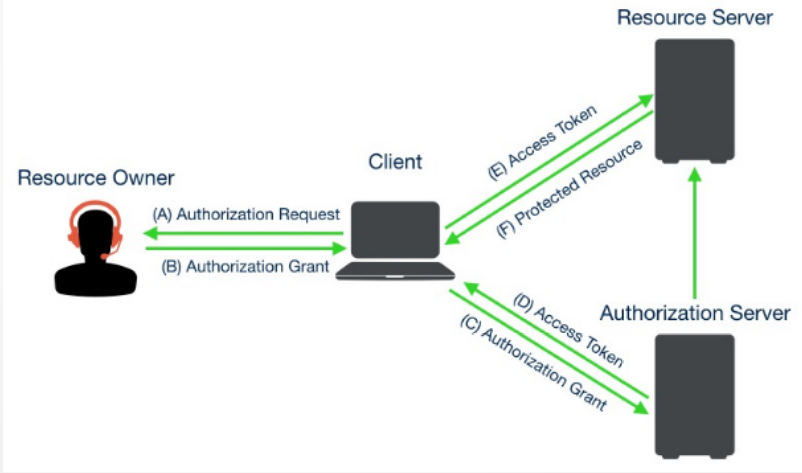

# 认证系统解决方案

### 方案一：将已有代码打成pip包，需要时安装即可

1. 为什么这么设计？（用户分离）

   特点：

   - 因RBAC组件封装好后，改动性并不大，维护成本基本上可以忽略不计

   扩展、灵活度：

   - 如需在框架基础上进行二次开发、对原有功能进行扩展，则直接继承RBAC的User表即可

   原因：

   - 因每个系统都有自己的用户、角色、权限，所以将其放在各自的业务系统中管理和维护

2. 如何使用？

   ① 提供一个基础命令，执行该命令后生成相应的基础表

   ② 提供入口，业务系统中涉及到用户、角色、权限时，均调用RBAC的提供的基础接口

   ③ 提供工具，生成系统中所有权限到RBAC表中

3. 成本考虑？

   - 维护成本：因系统设计好后的改动几率不大，核心功能已有，基本上不需要维护
   - 集成成本：
     - 使用pip安装独立的RBAC模块
     - 初始化数据库表结构
     - 在业务系统中注册相应的中间件（认证、权限）
     - 添加统一RBAC入口
     - 使用工具生成权限列表到RBAC库中

   - 开发成本：
     - 对已有框架进行优化即可

### 方案二：使用SSO单点登录 + OAuth2 + JWT

1. **将客户端（Client）注册到SSO服务中**，（同时将客户端权限注册到SSO服务中资源服务）
2. **注册客户端成功后，授权服务给客户端生成（client_id、client_secret）**
3. **当资源拥有者访问某客户端系统时，若用户未登录，则跳转至SSO单点登录系统进行登录**
4. **用户授权成功，重定向至客户端系统提供的访问地址，并携带授权码（code）和state参数**（申请获取权限资源）
5. **客户端携带code，再次向认证服务申请访问令牌（access_token）**
6. **认证服务检验客户端信息，验证通过后颁发访问令牌（access_token）**（携带权限范围）
7. **客户端使用access_token访问受保护资源服务，资源服务验证access_token，校验通过后，返回权限列表**

- OAuth2.0 认证流程（授权码模式）

- OAuth2协议角色和流程（授权码模式）

**OAuth2四种方式**

- 授权码（authorization_code）
  - 用户登录授权，先拿code
  - 用code换token
- 隐藏式（implicit）简化
  - 用户登录授权，不拿code了，直接拿token

- 密码（password）
  - 用户提供给客户端账户和密码
  - 验证客户端（id、secret），直接用用户名和密码，拿token
- 客户端凭证（client_credentials）
  - 验证客户端、直接拿token

参考文献

- [OAuth2官方](https://oauth.net/2/)
- [OAuth2四种方式](https://www.jianshu.com/p/8f878e5537da)
- [OAuth2开源](https://github.com/llaoj/oauth2nsso/blob/master/README.md)
- [OAuth2系列](https://www.cnblogs.com/hellowhy/category/2046678.html)